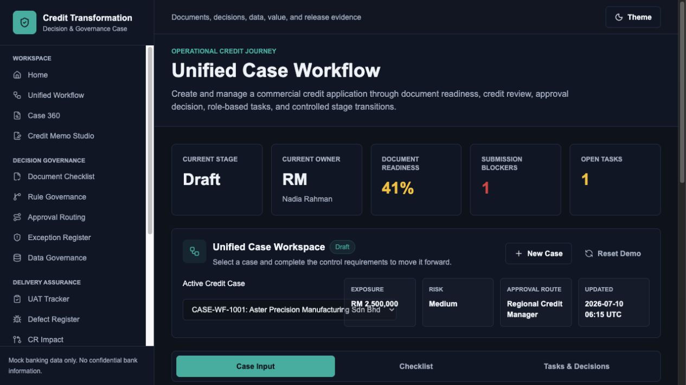

# Tan Ze Xiang - Banking Business Analyst Portfolio

An evidence-led personal portfolio for Credit Operations Business Analyst, Loan Origination System Analyst, Banking Systems BA, and Financial IT Business Consultant roles.

**Live portfolio:** [https://xiang13-gif.github.io/Xiang13.github.io/](https://xiang13-gif.github.io/Xiang13.github.io/)



## What This Portfolio Proves

- Banking system delivery experience since 2019
- Loan origination, business credit, retail banking, and FX-system exposure
- Requirement analysis, business rules, impact analysis, and traceability
- SIT, UAT, regression, defect triage, and production verification
- Risk and control thinking through maker-checker, audit evidence, and release gates
- Technical collaboration through SQL, logs, APIs, data validation, TypeScript, testing, and GitHub
- Clear contribution and decision boundaries for anonymized professional-experience cases

## Featured Evidence

| Case | Type | Purpose |
| --- | --- | --- |
| CreditFlow BA Toolkit | Portfolio project | Public, interactive evidence of requirements, rules, UAT, defects, CR impact, traceability, and release decisions |
| Loan Origination Enhancement Delivery | Anonymized professional experience | Shows contribution boundaries, ambiguity resolution, impact analysis, testing, defects, and release-support methods |
| FX Deal System Enhancement Support | Anonymized professional experience | Shows adaptable BA practice, control ownership, and testable regulatory-process reasoning |

CreditFlow live demo: [business-credit-system-enhancement-case-study](https://xiang13-gif.github.io/business-credit-system-enhancement-case-study/)

## Portfolio Structure

- `/` recruiter-first summary and strongest evidence
- `/experience` verified work-history responsibilities
- `/projects` three complementary case studies
- `/projects/[slug]` structured BA case-study detail
- `/about` professional focus and working principles
- `/resume` public resume summary and sanitized PDF
- `/contact` direct email, LinkedIn, GitHub, and location

## Tech Stack

- Next.js App Router and React
- Strict TypeScript
- Tailwind CSS
- Lucide icons
- Accessible light and dark themes with a minimal native control
- Static export for GitHub Pages

The MVP intentionally has no database, login, CMS, analytics, or contact-form backend.

## Run Locally

Requirements: Node.js 22 and pnpm 11.

```bash
pnpm install
pnpm dev
```

Open `http://127.0.0.1:3000`.

## Quality Checks

```bash
pnpm run check
```

This runs ESLint, TypeScript validation, and a production static build.

## Content Maintenance

Update structured content in:

- `lib/data/profile.ts`
- `lib/data/experience.ts`
- `lib/data/projects.ts`
- `lib/data/skills.ts`
- `lib/data/deliverables.ts`

Project screenshots are stored in `public/projects/`. The public resume is stored in `public/resume/` and can be regenerated with `scripts/generate_resume.py`.

## Deployment

`.github/workflows/deploy-pages.yml` validates the project, exports the static site, and deploys `out/` to GitHub Pages after changes reach `main`.

For a custom domain or Vercel deployment, set:

```text
NEXT_PUBLIC_SITE_URL=https://your-domain.example
```

## Privacy and Evidence Boundary

Portfolio projects use mock data and generalized banking workflows. They are not connected to any bank system and contain no confidential client, customer, policy, or production information. Professional experience summaries are intentionally anonymized, distinguish individual contribution from team delivery, and do not publish confidential or unverified performance metrics.

## License

Code is available under the [MIT License](LICENSE). Personal resume content, professional history, and case-study narrative remain the author's portfolio content.
